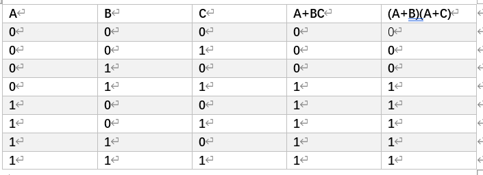

# 暨南大学数字电子课后作业速通

by Blossom.

#### 作业1

>原码：是最简单的机器数表示法，用最高位表示符号位，其他位存放该数的二进制的绝对值。
>反码：正数的反码还是等于原码；负数的反码就是它的原码除符号位外，按位取反。
>补码：正数的补码等于它的原码；负数的补码等于反码+1

1):原码：`01100111`  补码：`01011001`
2):原码：`01011011`  补码：`01011011`

>BCD码`Binary-Coded Decimal`，用4位二进制数来表示1位十进制数中的0~9这10个数码，是一种二进制的数字编码形式，用二进制编码的十进制代码。
>1. `8421 BCD码`是最基本和最常用的BCD码，它和四位自然二进制码相似，各位的权值为8、4、2、1，故称为有权BCD码。和四位自然二进制码不同的是，它只选用了四位二进制码中前10组代码，即用0000~1001分别代表它所对应的十进制数，余下的六组代码不用。
>2. `5421 BCD码`为有权BCD码，它们从高位到低位的权值分别为5、4、2、1。在有权BCD码中，有的十进制数码存在两种加权方法，例如，`5421 BCD码`中的数码5，既可以用1000表示，也可以用0101表示,这说明`5421 BCD码`的编码方案不是惟一的
>3. `余3码`是8421 BCD码的每个码组+3(0011)形成的。常用于BCD码的运算电路中。

| 8421      | 5421 |   余3     |
| :---        |    :----:   |          ---: |
| `0110 0011 . 0010`      | `1000 0011 . 0010`       | `1001 0110 . 0101`   |
| `0101 0101 . 0001 0010`   | `1000 1000 . 0001 0010`        | `1000 1000 . 0100 0101`      |

>1、**奇偶校验**是用来检查数据传输的正确性的方法。奇偶校验能检测出传输数据的部分错误（1位误码能检测出，2位及2位以上检测不出来），而且不能纠错，在发现错误后，只能要求重发。由于简单所以被广泛应用。
 2、这种方法是在每一字节中加上一个奇偶校验位，并被传输，即每个字节发送九位（8位+1位校验位）数据。1个字节（byte）=8位（bit）。
 3、数据传输以前通常会确定是奇校验还是偶校验，以保证发送端和接收端采用相同的校验方法进行数据校验。假如校验位不符，则认为传输出错。
 4、奇校验：一个字节8位中“1”的个数，校验位，添加一位，使9位中“1”的个数为奇数；偶校验同理。
 5、校验的原理是：假如采用 奇校验，发送端发送的一个字符编码（含校验位）中，“1”的个数一定为奇数个，在  接收端对接收字符二进制位中的“1”的个数 进行统计，若统计出“1”的个数为偶数个，则意味着传输过程中有1位（或奇数位）发生差错。

- `It's F8`奇检验:
`01001001` `11110100` `10100111` `01110011`
`00100000` `01000110` `00111000`

- 十六进制表示：
**49 F4 A7 73 20 46 38**

>**有权码**：各个编码位都有固定的权值
>**无权码**：找不到一组权值，满足所有码字

1. `(a)`不是有权码
2. `(b)`是，权值为`2 4 2 1`
3. `(c)`是，权值为`6 3 1 -1`

#### 作业2

>**反演规则**
反演规则即对原函数取反，将乘换成加，加换成乘，原变量换成反变量，反变量换成原变量，1换成0，0换成1，即可得到反函数。
>**对偶规则**
将乘换成加，加换成乘，1换成0，0换成1，即可得到对偶式。对一个逻辑函数取两次对偶式的结果与原式相等。

#### 作业3

#### 作业4

#### 作业5

#### 作业6

#### 作业7

